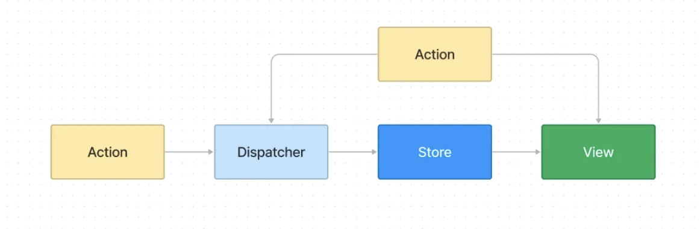

`created at 25.02.10`

### 1. 리액트는 왜 필요한가요 ?

- 웹 초창기에는 정적적으로 페이지를 로드함
- 웹이 발전하면서 정적 페이지를 로드하는 시간, 로드가 되면서 발생하는 리플로우의 비용이 비효율적이며, 상태의 추적이 어렵고 보안에 취약함
- 이를 개선하기 위해 리액트가 등장함

### 2. 리액트 이전의 세계

- 리액트가 생기기 이전에는 다음과 같은 툴을 사용했다.
  - JQuery : DOM 조작 및 이벤트 핸들링을 쉽게 해주는 라이브러리
  - Backbone : MVC 패턴을 적용, 애플리케이션 구조화
  - Knockout : MVVM 패턴을 적용, 선언형 바인딩 및 데이터 구독 방식 지원
  - AngularJS : 양방향 데이터 바인딩, 모듈식 아키텍처 도입
- 앵귤러의 도입으로 웹 개발이 크게 발전했으나, 다음과 같은 한계가 있었다.
  - 양방향 데이터 바인딩의 성능 문제
  - 컨트롤러, 서비스, 의존성 주입, 팩토리 등의 새로운 개념과 템플릿 문법의 복잡성
  - 앵귤러 2 출시 후의 마이그레이션 어려움

### 3. 리액트 등장

- 리액트는 아래와 같은 특징을 가짐
  - 선언적 코드와 명령형 코드
    - 리액트는 “어떤 것을 보고싶은지”를 선언적으로 작성할 수 있게 추상화 되어있음
    - “어떻게 이룰것인지”는 내부적으로 처리함
  - 가상 DOM
    - 실제 DOM을 자바스크립트 객체로 표현하는 프로그래밍 개념
    - 가상 DOM에서 발생한 모든 변경사항은 재조정을 통해 실제 DOM에 적용됨
    - 재조정 : 새로 만들어진 가상 DOM과 상태 변경 이전의 가상 DOM을 비교하는 과정
  - 컴포넌트 모델
    - DRY 개발 : 컴포넌트를 재사용하면 문제 발생 시 한 곳만 수정하면 되기 때문에 유지보수에 용이
    - 키잉 : key프롭을 추가해 컴포넌트를 쉽게 추적하는 방식
    - 합성 : 여러 컴포넌트를 조합해 사용하는 방식
  - 불변상태
    - 리액트는 불변성을 강제시켜 특정 시점에서 특정 상태를 보장해 디버깅에 용이함
- 리액트 개발 이후 단방향 데이터 흐름을 강조한 **플럭스 아키텍쳐**가 등장
  
  - 엑션 : 새로운 데이터와 함께 발생하는 이벤트
  - 디스패처 : 액션을 받아서 스토어로 전달하는 중앙 허브
  - 스토어 : 애플리케이션의 상태(state)를 관리
  - 뷰 : 스토어에서 제공하는 데이터를 기반으로 UI를 렌더링

### 4. 그래서… 리액트는 왜 필요한가요 ?

- 결론적으로 리액트는 더 예측 가능하고, 신뢰성 있는 방식으로 사용자 인터페이스를 작성할 수 있게하고, 화면에 나타내고자 하는 바를 선언적으로 표현할 수 있게 함
- 컴포넌트 단위로 관심사를 분리하고 재사용성을 높여줌
- 다양한 도구, 라이브러리, 리소스를 갖춰 방대한 생태계가 조성되어 있음
